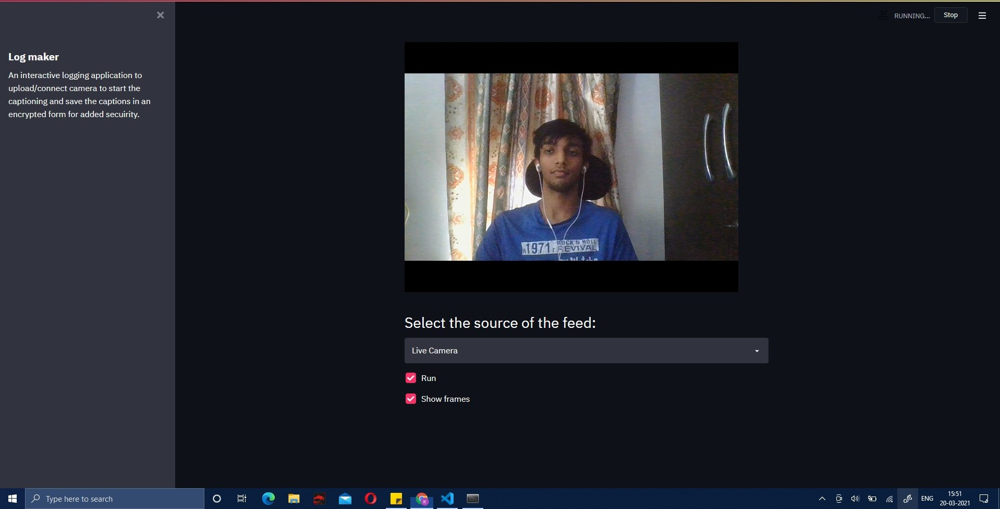
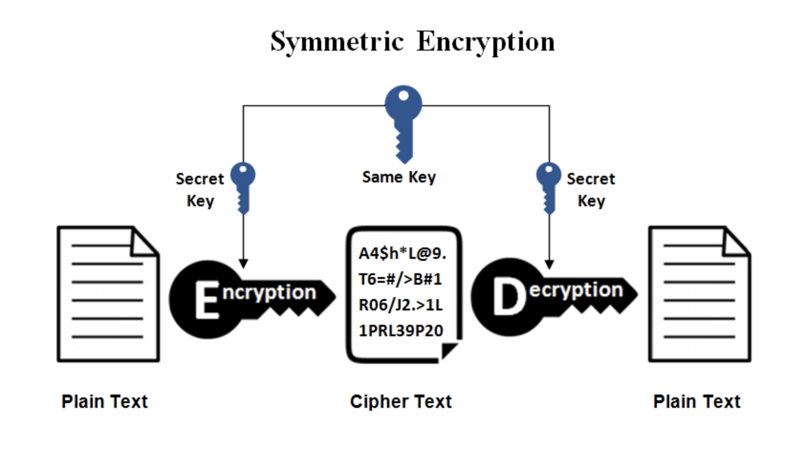

## Proposed Solution 
We propose a Deep Learning Application that will be able to solve the above mentioned problems. 
- Our application named ‘Cap-Bot’ is capable of running Image Captioning on multiple CCTV footages and storing the captions along with the camera number and the time of capture in a convenient log. 
 
- The file of saved captions can then be used to look up for incidents from any instant of time just by entering a few keywords.  The returned camera number and time slot can then be used to obtain the required CCTV footage. 

 
- Since the information is purely textual, the encryption of information is way easier than pictorial. 
 
  
## Steps of Deployment
- [x] Training the Model
- [x] Write the Search Module
- [x] Captioning UI
- [x] Search UI
- [x] Perfecting Search feature 
- [x] Resolving Backend
- [x] Encryption of Generation Captions 

- Setting up the Python Environment with dependencies 

        pip install -r requirements.txt

- Entering the directory for captioning: 

        cd capbot2.0/camera
- Running the captioning web application:

        streamlit run feed.py
- Entering the directory for searching: 

        cd capbot2.0/search
- Running the searching web application:

        streamlit run search.py
- Stopping the web application from the terminal

        Ctrl+C
        

